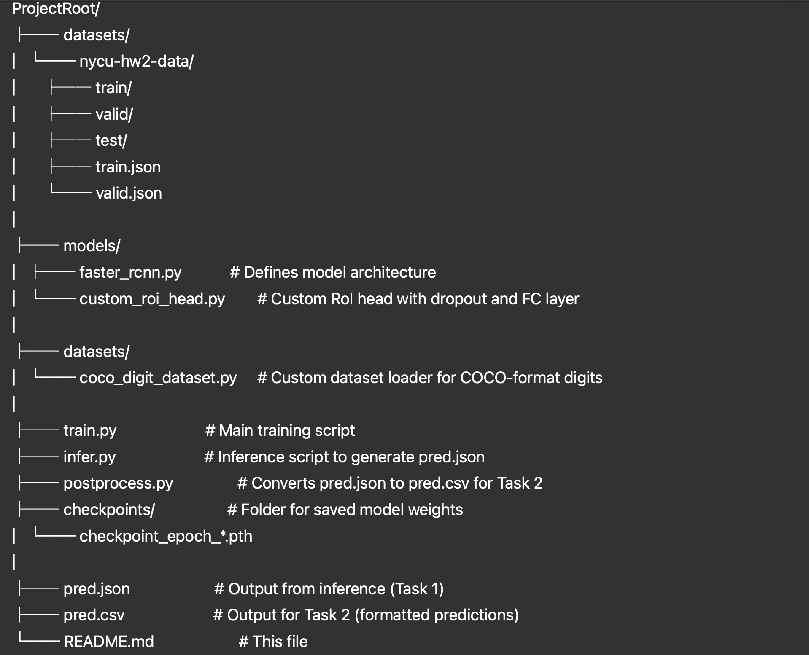

# Digit Recognition with Faster R-CNN

This project tackles the dual task of digit localization and sequence recognition using a modified Faster R-CNN model with a SE-ResNet50 backbone.

---

## 📁 Project Structure

## Usage
### 1. Install Dependencies

```bash
pip install torch torchvision timm pycocotools safetensors
```
### 2. train the model
```bash
python3 train.py
```

### 3. run inference (task1)
```bash
python3 infer.py
```

### 4. generate output (task2)
```bash
python3 postprocess.py
```
